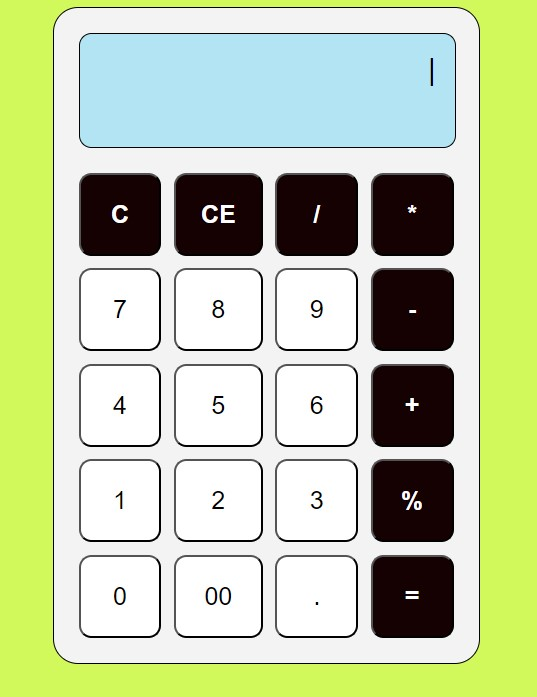

# TAREA
_Usando Flex o Grid (puede ser ambos), crear una pagina de una calculadora. El diseño de su calculadora es libre puede ser minimalista o moderna eso dependerá de tu creatividad, además no se debe usar JavaScript (js)._
 
_Para tener un orden, tu proyecto deberá estar en un nuevo repositorio. Además de crear un readme explicando el uso de las propiedades que has utilizado en tu pagina web, como adicional a esto en el propio readme adjuntar captura de pantalla de la pagina._

---
## EXPLICACION
1.	font-family: define una lista de fuentes
2.	display: para poder abrir flex o grid
3.	justify-content: alinea los elementos en forma horizontal en el contenedor
4.	align-items: alinea los elementos en forma vertical en el contenedor
5.	background-color: sirve para dar color al fondo de un elemento
6.	border: agregar borde a un elemento
7.	width: define el ancho especifico de un elemento
8.	padding: sirve para añadir un espacio dentro de un elemento
9.	border-radius: sirve para redondear las esquinas de un borde
10.	height: define la altura especifica de un elemento
11.	margin-bottom: establece el espacio en la parte inferior de un elemento.
12.	text-align: alinea el texto dentro de un elemento
13.	font-size: define el tamaño del texto.
14.	grid-template-columns: define el número y tamaño de las columnas
15.	gap: establece el espacio entre los elementos
16.	cursor: define el tipo de cursor
17.	color: establece el color del texto.
18.	font-weight: define el grosor del texto
___
## IMAGENES
-   **CALCULADORA**

